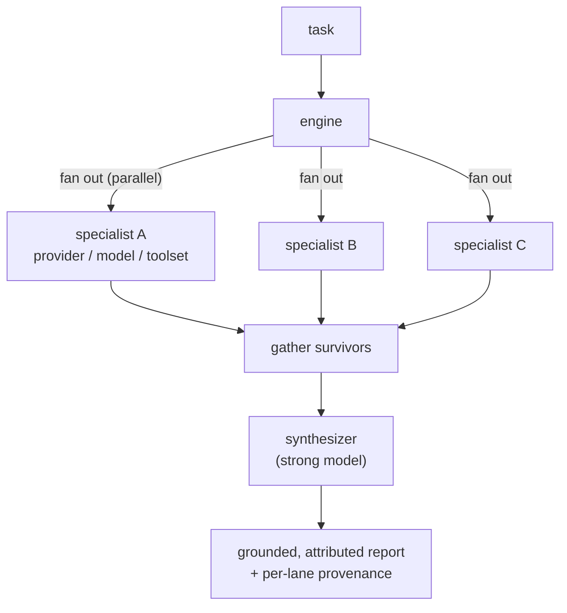
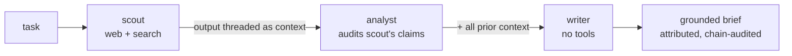

# Cadre

Provider-neutral, ephemeral, **multi-model agent fleets**. Fan a task out across whatever models you have — Grok, Gemini, Claude, GPT, OpenRouter, or local — each a specialist with its own model and toolset, then **synthesize** them into one grounded, attributed result, **collect** their independent findings side by side, or have an independent model **judge** each one. Run the lanes in parallel, or as a **sequential chain** where each stage audits the last. Built on [Hermes](https://hermes-agent.nousresearch.com)'s `AIAgent` library.

> **Status: `v0.1.0` — building in public.** The engine, run capture, live per-lane progress, cross-model review fleets, sequential and iterative (debate / critique-revise) topologies, and the agent-run handoff are all shipped and **dogfooded live** on a Hermes host — a Hermes agent has driven a four-model fleet end-to-end (preview → human okay → grounded, attributed result). Early and evolving — expect APIs to change.

## Quickstart

On a Hermes host, install `cadre` into the Hermes venv and run a fleet — no repo clone required. (`$PYBIN` is the Python that runs Hermes; the [full walkthrough](#install-and-run-it-on-your-hermes-host) below covers finding it and editing your palette + fleet.)

```bash
"$PYBIN" -m pip install --force-reinstall --no-deps "git+https://github.com/jarodtaylor/cadre@v0.1.0"
"$PYBIN" -m cadre.cli setup           # provision ~/.cadre from the package
"$PYBIN" -m cadre.cli verify-palette  # after editing ~/.cadre/palette-candidates.yaml to your models
"$PYBIN" -m cadre.cli run ~/.cadre/fleets/research-swarm.yaml --task "<your question>"   # after setting the fleet's models
```

Prefer to understand it first? Read on — [how it works](#how-it-works), then the [full host walkthrough](#install-and-run-it-on-your-hermes-host).

## Why

You're running a Hermes agent, and it needs to spread work across helpers — review its own plan, validate a diff, research a question from several angles. Hermes can delegate to subagents, but they all run the **same** model. So you get parallelism without diversity: five takes from one point of view.

Cadre fixes that. You describe a **fleet** in a YAML file — a handful of specialists, each its own provider, model, and toolset — and Cadre runs them, then combines their output into one report that **attributes each claim to the model that surfaced it**. No extra Hermes profile, workspace, or memory to set up; just a fleet file.

Why bother with different models? Decomposing a task into specialist lenses is what drives coverage; running those lenses across *diverse* models adds independent cross-checking and resilience, and surfaces what any single model's blind spots miss. A single-vendor runtime can only fan out across one provider's own tiers — Cadre routes real-time social to Grok, broad web to a fast model, deep analysis to a strong one, a contrarian read to another. See [STRATEGY.md](STRATEGY.md).

The primitive is general: **any fleet you can describe in config**, not a fixed menu. A few come pre-baked to get you started — a research swarm, a code-review swarm, a docs-review swarm — and the aim is runtime-agnostic, so you run your fleets wherever your agents live (Hermes today; more runtimes as reach).

## How it works

A *fleet* is defined entirely in YAML — specialists (each a role + provider + model + toolset) plus an optional synthesizer — and has two independent **shape axes**:

- **Topology** — how lanes relate in time: **parallel** (independent and concurrent, the default fan-out), **sequential** (a dependent chain where each stage consumes all preceding stages' output — e.g. a scout gathers sources, then an analyst *audits the scout's specific claims* against live verification, then a writer synthesizes the audited brief), or **iterative** (lanes run for multiple rounds; from round 2 each lane sees the prior round's attributed outputs from all other lanes — enabling debate, critique-revise loops, and self-refinement; the round-by-round transcript is preserved in the run folder).
- **Convergence** — what happens to the outputs: **synthesize** (a strong model combines the survivors into one grounded report), **collect** (no synthesizer — return each specialist's attributed output side by side, as the review fleets do), or **judge** (an independent critic grades each surviving specialist in place, attributed per lane).

Synthesize degrades rather than crashing: if some lanes fail it synthesizes the rest and reports the failures, failing outright only when none survive. A sequential chain breaks on the first failed stage and marks the rest skipped.



*…or the same fleet model runs as a **sequential chain** — each stage consumes all previous stages' output (the `research-brief` flagship: scout gathers → analyst audits the scout's specific claims → writer synthesizes):*



Every model call is isolated behind one thin adapter over Hermes's `AIAgent` (`cadre/model_client.py`), so the engine **runs and tests without Hermes installed** — the rest of the suite uses fakes. Each call is bounded by a wall-clock backstop, and the toolset gate is a **fail-closed allowlist**: a specialist (which may read untrusted web content) gets only non-privileged tools from the `SAFE_TOOLSETS` allowlist — read/search/analyze, content generation, and internal reasoning/planning — and **never** system access (terminal, file, browser, code execution) unless a fleet explicitly opts into `allow_privileged_tools: true`. Every run is **captured** to `~/.cadre/runs/<timestamp-slug>/` — per-specialist markdown, the synthesis, and a JSON manifest (per-lane outcome, elapsed, toolset, timed-out; run-level status + active profile) — so a run is auditable after the fact.

## What running it looks like

On a provisioned Hermes host, one command runs a fleet:

```bash
"$PYBIN" -m cadre.cli run ~/.cadre/fleets/research-swarm.yaml \
    --task "What are the current best practices for prompt-caching with the Anthropic API?"
```

It streams live per-lane progress to stderr, then prints the result to stdout — one attributed report, a provenance block, and a pointer to the captured run folder:

```
=== research-swarm — synthesized result ===
… one grounded report — each claim tagged to the specialist (role + model) that
  surfaced it, sources preserved, cross-model conflicts called out …

--- provenance ---
[ok  ] social   (xai-oauth/grok-4.3)
[ok  ] web      (openrouter/google/gemini-3-flash)
[ok  ] analysis (openrouter/anthropic/claude-sonnet-4.6)

Run folder: ~/.cadre/runs/2026-07-05-…-what-are-the-current-best-practices/
```

The report stays alone on stdout (pipe it, capture it); the `[cadre]` progress breadcrumbs go to stderr.

## Install and run it on your Hermes host

You need a host with `hermes-agent` installed and at least one provider authenticated — Cadre's multi-model value shows with two or more across different vendors, but a single-provider fleet runs fine. **No repo clone required** — `cadre` installs from git as a self-contained package. The five steps:

**1. Find the Python that runs Hermes.** Cadre runs *inside* Hermes — it calls Hermes's own code to reach your models — so it installs into the **same Python environment Hermes uses**, not your system Python. (Like a VS Code extension: it installs *into VS Code*, not just "onto your computer." You almost certainly have Python — this is about using the *right* one.) That Python's path varies by install; the common root-Linux location:

```bash
PYBIN=/usr/local/lib/hermes-agent/venv/bin/python
"$PYBIN" -c "import run_agent; print('Hermes venv OK')"   # confirms it's the right one
```

If that path doesn't exist or the import fails, [`docs/RUNBOOK.md`](docs/RUNBOOK.md) shows how to locate your venv (non-root, Termux, Docker, and custom installs differ).

**2. Install `cadre` into it** — pin the release tag:

```bash
"$PYBIN" -m pip install --force-reinstall --no-deps "git+https://github.com/jarodtaylor/cadre@v0.1.0"
```

`--no-deps` keeps cadre from touching Hermes's own dependency pins; `--force-reinstall` matters on upgrades — pip no-ops an unchanged version otherwise. cadre's only runtime dependency is `pyyaml`, which the Hermes venv already carries — but if yours somehow doesn't, run `"$PYBIN" -m pip install "pyyaml>=6.0"` first, since a `cadre` command errors at import without it. A **bare `pip install cadre` grabs a different, unrelated package on PyPI** — always use the git URL.

> **Tip — type less.** The install also puts a `cadre` command *in that venv*. The steps below use `"$PYBIN" -m cadre.cli …` because it works in any shell with zero extra setup. If you'd rather just type `cadre …` (e.g. `cadre run …`), activate the venv for this session — `source "$(dirname "$PYBIN")"/activate` — or add that `bin` directory to your `PATH` to make it stick.

**3. Provision `~/.cadre`:**

```bash
"$PYBIN" -m cadre.cli setup
```

Scaffolds `~/.cadre` owner-only and seeds the seven starter fleets, the review **personas** (reusable, richer specialist definitions that fleets like `doc-review` use in place of an inline `focus` — see [CONCEPTS.md](CONCEPTS.md)), and a `palette-candidates.yaml` from the installed package (no repo reads), recording your Hermes Python to `~/.cadre/config`.

**4. Verify your palette.** Edit `~/.cadre/palette-candidates.yaml` down to the `(provider, model)` pairs you've actually authenticated, then verify them live:

```bash
"$PYBIN" -m cadre.cli verify-palette
```

This makes a real call per candidate and writes the ones that resolve to `~/.cadre/palette.yaml` — your verified menu. (The seeded candidates are examples; a pair that isn't authenticated on your host is skipped, which is normal.)

**5. Edit a fleet, validate it, then run.** The starter fleets seed with **placeholder** model strings — open one and set the strings from *your* `~/.cadre/palette.yaml`, then `validate` before you run. Validate **fails** on malformed YAML (a stray tab, a missing field) and **flags** any model that isn't in your palette — so problems surface *before* you run, not mid-run after a call's been spent:

```bash
# edit ~/.cadre/fleets/research-swarm.yaml → set each lane's provider/model to a verified pair
"$PYBIN" -m cadre.cli validate ~/.cadre/fleets/research-swarm.yaml           # free preflight: YAML + off-palette check
"$PYBIN" -m cadre.cli run ~/.cadre/fleets/research-swarm.yaml --task "<your real question>"
```

That's it — you get the attributed report shown above, captured under `~/.cadre/runs/`.

> **One thing that bites:** a fleet runs under **one** Hermes profile, and a `web`/`x_search` lane only draws live data if *that profile* holds the tool credentials — otherwise the lane silently answers from training knowledge, no error. If a run comes back oddly ungrounded, that's almost always it. [`docs/RUNBOOK.md`](docs/RUNBOOK.md) is the full checklist — profiles, tool creds, timeouts, and the silent-failure modes to watch.

## Use it from a Hermes agent

Beyond the direct CLI, a Hermes agent can run Cadre conversationally through the discoverable **`cadre-fleet` skill** — pick or compose a fleet, **preview the actual parsed fleet for a human okay**, run it, and weave back the attributed result. Install the skill from the package:

```bash
HERMES_SKILLS_DIR=/path/to/hermes/skills "$PYBIN" -m cadre.cli install-skill
```

The agent composes fleets from the host-verified `~/.cadre/palette.yaml` (the preview flags off-palette picks as advisory warnings — guidance, not a hard runtime gate), and the **preview is the operative control**: it renders mechanically from the parsed fleet (synthesizer, `allow_privileged_tools`, the synthesis prompt, every lane) and exits *without a model call* — so a human approves *what actually runs*, not the agent's paraphrase. A fleet that opts into privileged tools (`allow_privileged_tools: true`) is approved with `--approve-privileged` in place of the plain preview — the preview okay alone won't authorize privileged execution. Safe toolsets still read untrusted web content and the synthesis is consumed by a terminal-capable agent, so prompt-injection/SSRF is a named, deferred risk — see [`cadre/data/skill/SKILL.md`](cadre/data/skill/SKILL.md), [SECURITY.md](SECURITY.md), and [`docs/RUNBOOK.md`](docs/RUNBOOK.md).

## Develop / contribute

The engine imports and the full suite passes **without** `hermes-agent` (the adapter lazy-imports it; tests use fakes), so you can work on everything but a live run on a dev machine:

```bash
python3.11 -m venv .venv          # Python >=3.11,<3.14
.venv/bin/pip install -r requirements-dev.txt
.venv/bin/python -m unittest discover -s tests                                   # run the suite
.venv/bin/python -m cadre.cli validate cadre/data/fleets/research-swarm.example.yaml
```

With the repo present these run with no install — the top-level `cadre` package imports from the working directory. [AGENTS.md](AGENTS.md) orients AI agents working in the repo.

## Roadmap

v0 — the engine, run capture, and the Hermes **agent-run handoff** — is shipped and dogfooded live, and `v0.1.0` closes the v1 milestone (packaging, the real `cadre` CLI, the topology and convergence primitives, and the defensive trust-safety pass). Work is organized into four tracks (filter issues by their `track:` label, or see the [**v1 milestone**](https://github.com/jarodtaylor/cadre/milestone/1)):

- **Operator & agent experience** (`track: operator-dx`) — runs that feel alive and trustworthy.
- **Fleet library & primitives** (`track: fleet-library`) — batteries-included fleets + new primitives.
- **Trust & safety hardening** (`track: trust-safety`) — the human-approval gate, bulletproof.
- **Reach & packaging** (`track: reach`) — a real `cadre` package + more runtime wrappers.

See [STRATEGY.md](STRATEGY.md) for the full direction.

## Learn more

- **[CONCEPTS.md](CONCEPTS.md)** — shared vocabulary (fleet, specialist, synthesizer, verified palette, fleet library, fleet preview, and the topology × convergence shape model).
- **[SECURITY.md](SECURITY.md)** — what the defensive hardening protects against (display spoofing, forged judge markers, install seeding) and what stays a bounded residual (semantic prompt injection). Cadre is not "injection-proof" — this says plainly what is and isn't defended.
- **[STRATEGY.md](STRATEGY.md)** — the product's target problem, approach, and tracks of work.
- **[`docs/RUNBOOK.md`](docs/RUNBOOK.md)** — the full deploy, install, and agent-run usage checklist.

## License

[MIT](LICENSE) © 2026 Jarod Taylor
