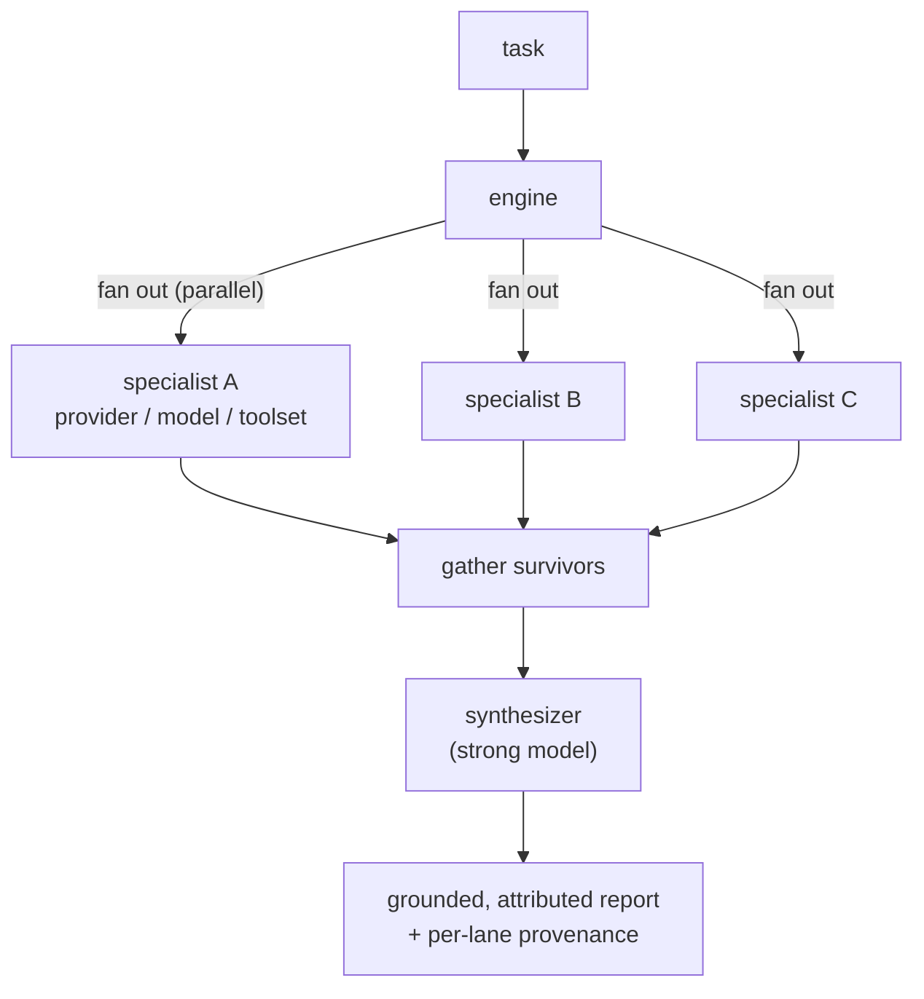
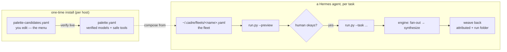

# Cadre

Provider-neutral, ephemeral, **multi-model agent fleets**. Fan a task out across whatever models you have — Grok, Gemini, Claude, GPT, OpenRouter, or local — each a specialist with its own model and tools, then synthesize one grounded, attributed report. Built on [Hermes](https://hermes-agent.nousresearch.com)'s `AIAgent` library.

> **Status: building in public.** The engine and the agent-run handoff are built and unit-tested; live multi-provider dogfooding is in progress on a Hermes host. Expect APIs to change.

## Why

A single-vendor runtime can only fan a task out across one provider's own tiers. Cadre routes the right subtask to the right *provider* — real-time social from Grok, broad web from a fast model, deep analysis from a strong one, a contrarian read from another — then synthesizes one report that **attributes each claim to the model that surfaced it**. Diverse models catch what same-model ensembles miss. See [STRATEGY.md](STRATEGY.md).

## How it works

One orchestration primitive — **parallel fan-out → synthesize** — over a *fleet* defined entirely in YAML (specialists, each a role + provider + model + toolset, plus a synthesizer). Specialists run concurrently; the synthesizer combines the survivors. It degrades rather than crashing: if some lanes fail it synthesizes the rest and reports the failures; it fails outright only when none survive.



All model calls are isolated behind one thin adapter over Hermes's `AIAgent` (`fleet_engine/model_client.py`), so the engine **runs and tests without Hermes installed** — the rest of the suite uses fakes. Each model call is bounded by a wall-clock backstop, and the toolset gate is a **fail-closed allowlist**: a specialist (which may read untrusted web content) only gets read/search/analyze tools unless a fleet explicitly opts into `allow_privileged_tools: true`.

Every run is **captured** to `~/.cadre/runs/<timestamp-slug>/` — per-specialist markdown, the synthesis, and a JSON manifest (per-lane outcome, elapsed, toolset, timed-out; run-level synth status + active profile) — so a run is auditable after the fact.

## Using it with a Hermes agent (the agent-run handoff)

A Hermes agent can run Cadre conversationally through the discoverable **`cadre-fleet` skill**: pick a curated fleet or compose one from a host-verified palette, **preview the actual parsed fleet for a human okay**, run it, and weave back the grounded, attributed result.

Two files do two different jobs:

| File | Role | Who writes it |
|---|---|---|
| `~/.cadre/palette.yaml` | The **menu** — `(provider, model)` pairs verified to resolve on *this* host, plus the safe toolsets the profile declares | Generated by install from `palette-candidates.yaml` you edit |
| `~/.cadre/fleets/<name>.yaml` | The **recipe** — which specialists (role + model + toolset) and synthesizer make up a fleet, composed from the menu | You or the agent |



The **preview is the operative control**: it renders mechanically from the parsed `FleetConfig` (the synthesizer, `allow_privileged_tools`, the synthesis prompt, and every lane) and exits without making a model call — so a human approves *what actually runs*, not the agent's paraphrase. Safe toolsets still read untrusted content and the synthesis is consumed by a terminal-capable agent, so prompt-injection/SSRF is a named, deferred risk; see `skills/cadre-fleet/SKILL.md` and `docs/RUNBOOK.md`.

## Quick start (development)

```bash
python3.11 -m venv .venv          # Python >=3.11,<3.14
.venv/bin/pip install -r requirements-dev.txt
.venv/bin/python -m unittest discover -s tests                                   # run the suite
.venv/bin/python -m fleet_engine.cli validate fleets/research-swarm.example.yaml
.venv/bin/python skills/cadre-fleet/run.py --fleet fleets/research-swarm.example.yaml --preview  # render a fleet, no model calls
```

The engine imports and the suite passes **without** `hermes-agent` (the adapter lazy-imports it; tests use fakes).

## Running live

Running a fleet for real needs a Hermes host with `hermes-agent` installed and providers authenticated. `docs/RUNBOOK.md` is the ordered checklist: install → verify the palette → compose a fleet → preview → run. The repo's `fleets/*.example.yaml` are **templates** — copy one into `~/.cadre/fleets/` and set your host-verified strings. Never commit API keys or tokens; credentials live in Hermes auth/env.

## Learn more

- **[CONCEPTS.md](CONCEPTS.md)** — shared vocabulary (fleet, specialist, synthesizer, verified palette, fleet library, fleet preview, the fan-out→synthesize primitive).
- **[STRATEGY.md](STRATEGY.md)** — the product's target problem, approach, and tracks of work.
- **[AGENTS.md](AGENTS.md)** — orientation for AI agents working in this repo.
- **`docs/RUNBOOK.md`** — deploy, install, and the agent-run usage loop.

## License

TBD
