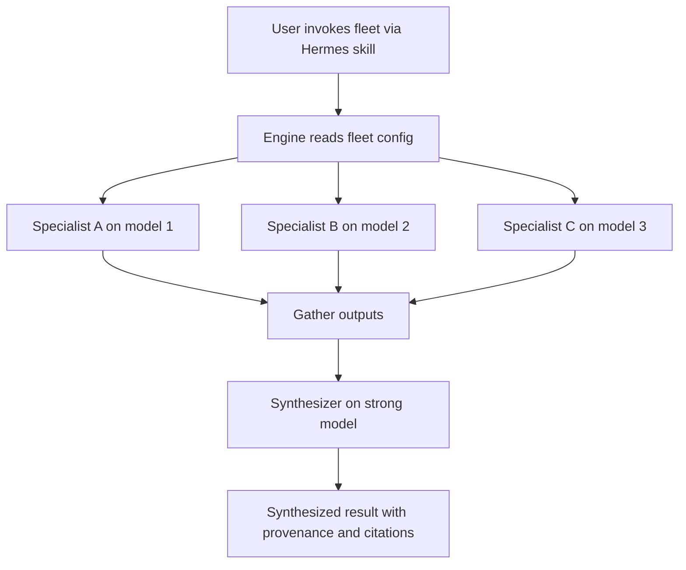

# Agent Fleet Engine — Requirements

## Summary

A provider-neutral engine that spins up **ephemeral fleets** — several agents running one task in parallel across whatever models the user has access to (cloud APIs, OAuth subscriptions, OpenRouter, local), then synthesized — invoked from Hermes as a skill. We build it **pattern-first**, starting with a multi-model research swarm, on an engine whose vocabulary is a small set of **composable orchestration primitives**, so new fleets are configuration rather than new code.

---

## Problem Frame

Multi-model work has no good home today. In Hermes, `delegate_task` spawns sub-agents but can't select a model per task — every delegated subtask inherits one global delegation model. In Claude Code, sub-agents and the Workflow tool fan out in parallel, but only across one vendor's tiers (the model options are `sonnet`, `opus`, `haiku`, `fable`) — there is no way to send a subtask to Grok for live social data, Gemini for cheap long-context sweeps, or a local model. So the thing that makes multi-model work valuable — routing the right subtask to the right *provider*, then synthesizing — has no first-class support.

A working multi-provider script already exists: Grok produced a ~40-line `AIAgent` orchestration in `docs/reference/01-multi-model-task-delegation-hermes.md`. But a one-off script is not a tool. It carries no reusable patterns, no developer experience, and no path to the dozens of fleet shapes beyond research the user will want.

Cost sharpens the constraint. In Hermes, Claude bills at API "extra usage" rates rather than the user's subscription, so the affordable fan-out is non-Anthropic. The status quo forces a choice between hand-editing throwaway scripts per task or staying locked to a single vendor and losing the leverage of provider diversity.

---

## Key Decisions

- **Engine, not a code generator.** A config-driven engine that *runs* fleets, not a generator that scaffolds standalone Python packages per fleet. Generated copies fork and drift; one engine compounds — a single fix or DX improvement reaches every fleet. This rejects the "factory" shape in `docs/reference/02-agent-fleet-factory.md`.

- **Standalone engine; Hermes is a thin wrapper.** Orchestration lives in provider-neutral Python that does not depend on Hermes. Hermes is one invocation surface — a skill that calls the engine. This keeps the cross-runtime north star to "write another small wrapper," not a rewrite.

- **Composable primitives, not a fixed pattern menu.** The engine's real vocabulary is a small set of orchestration primitives; the MVP needs exactly one (parallel fan-out → synthesize). A named pattern (research swarm, code review, validator) is a recipe: primitive + config. A new use case either reuses a primitive with new config (zero engine change) or adds one new primitive centrally (every future fleet benefits). The user is never blocked by "that is not a pattern."

- **Model-agnostic by design.** Fleets fan out across whatever models the user has access to — cloud APIs, OAuth subscriptions, OpenRouter, or local models. Named vendors are examples, not the set. The MVP scopes to a few models, but no part of the design hardcodes a provider list.

- **Efficacy is a property of the harness, not a metric to chase.** There is no bulletproof automated quality score, and any design that claims one is the thing to distrust. Quality comes from structure: a strong synthesizer, output the user can spot-check, and — later — an independent critic with fresh context and an adversarial mandate (the Claude Code advisor pattern). Confidence scores, when added, are triage signals, never ground truth.

---

## Requirements

**Orchestration engine**

- R1. A fleet runs as parallel fan-out → synthesize: N agents work one task concurrently, then their outputs are combined into a single result.
- R2. A fleet is fully defined by configuration — each specialist's role/focus, model, and toolset, plus the synthesis step — with no engine-code changes.
- R3. The engine keeps a clean separation between the orchestration primitive and a fleet's config, so additional primitives or fleets can be added without rewriting existing ones. The exact config/primitive shape is left to planning and validated against a second pattern, not designed from this one fleet alone.
- R4. Fleet agents run ephemerally and statelessly — a fresh agent per task, no persistent memory — and tear down when the task completes.

**Models and providers**

- R5. Each specialist can use a different model; the model set is user-specified and never hardcoded to a fixed provider list.
- R6. Model access spans the paths the user already has — cloud API keys, OAuth subscriptions, OpenRouter, and (later) local models. In the Hermes MVP, model and provider resolution ride on the user's existing Hermes provider configuration, with no credential re-wiring.

**Developer experience**

- R7. Adding or changing a fleet requires configuration only — zero Python edits.
- R8. A fleet is invoked with a single Hermes skill call.
- R9. Fleet output is human-readable and directly usable — a synthesized result, not raw concatenated agent outputs.

**Efficacy and output quality**

- R10. Synthesis runs on a strong, orchestrator-tier model.
- R11. Output preserves provenance: every claim traces to the specialist/model that produced it, and sources/citations are preserved so the user can spot-check in seconds.
- R12. The engine leaves a clean seam to compose an independent critique/scoring stage later, without reworking the fan-out → synthesize path. Any future confidence score is a triage signal, not ground truth.

---

## Core Flow

- F1. Research swarm run
  - **Trigger:** User invokes the fleet via a Hermes skill call with a task or query.
  - **Steps:** Engine reads the fleet config; spawns one ephemeral agent per specialist, each on its configured model and toolset, all in parallel; each specialist works the task and returns findings; the engine gathers all outputs; the synthesizer combines them into one result with provenance and citations preserved.
  - **Outcome:** A single synthesized, spot-checkable result returned to the user.
  - **Covered by:** R1, R2, R4, R9, R10, R11.

---

## Success Criteria

- v0 fans out across **at least 2 models with at least one non-Anthropic**, runs end-to-end in Hermes via one skill call, and returns a synthesized, provenance-tagged result.
- On a few real research tasks, the fleet's output visibly beats a single-model baseline. This is the user's periodic gut-check — calibration, not CI.
- The user reaches for the engine instead of hand-writing a script. That is the real bar for "a tool I actually use."
- Adding a second, differently shaped fleet (e.g., the scraping-tool evaluation) requires only new config — confirming the primitive/config seam holds.

---

## Scope Boundaries

### Deferred for later (roadmap, not v1)

- Additional fleet patterns beyond the research swarm — code/PR review, output validator, advisor panel, debate-and-judge — built as the user reaches for them.
- Additional orchestration primitives beyond fan-out → synthesize (critique loop, debate, sequential pipeline).
- The independent critic / confidence-scoring stage. The seam is designed in v1; the stage is built later.
- Other runtimes (Claude Code skill, standalone CLI, MCP server) and their provider-access story — including how OAuth-subscription models work outside Hermes.
- Local models (Gemma, Qwen) as fleet members — supported by the model-agnostic design, wired in after the cloud/OAuth path is proven.
- The auto-orchestrator north star: describe a task in plain language and have a meta-agent assemble the fleet on the fly.
- OSS packaging, docs, and positioning for users beyond the author.

### Outside this product's identity (positioning, not "never")

- Persistent-profile agent pipelines with crons, a kanban board, and human approval gates — the always-on autonomous triage model. That is a different product, and adjacent work (Tonbi Studio's `hermes-multi-agent-workflow`) already occupies it. This tool is ephemeral, on-demand fleets.
- A bulletproof automated quality metric for fleet output. It does not exist; chasing it is a category error. Efficacy is a harness property plus human spot-check.
- A general multi-agent framework competing with LangGraph/CrewAI/Mastra on features and adoption. Even the OSS north star optimizes for the author's real use, not market positioning.

---

## Dependencies / Assumptions

- **Hermes `AIAgent` library — core path verified.** The MVP rests on `AIAgent` accepting a per-task model and resolving it via the user's Hermes config. The Hermes python-library docs confirm: `model` is a per-instance constructor parameter ("Model in OpenRouter format... resolved from your hermes config at runtime"); credentials come from the same environment variables as the CLI (`OPENROUTER_API_KEY` / `OPENAI_API_KEY` / `ANTHROPIC_API_KEY`); and a fresh, stateless instance per thread is the documented parallel pattern. Source: `https://hermes-agent.nousresearch.com/docs/guides/python-library`.
- **OAuth-provider inheritance — assumption, verify first in planning.** The docs confirm provider resolution for the OpenRouter / API-key path but do not explicitly confirm that OAuth-configured providers (the user's Grok/Codex subscriptions) inherit the same way. Whether passing a model string reuses an OAuth provider, and the exact model-string format per provider, is the one open foundational item — verify before building.
- **Cost constraint shapes default models.** In Hermes, Claude bills at API "extra usage" rates rather than the user's subscription, so the cheap fan-out is non-Anthropic (Grok via OAuth, OpenRouter, local). Default specialist and synthesizer choices should reflect this. Exact model strings supplied by the user at planning.
- **Provider config already exists in the user's Hermes.** The engine assumes working providers are configured; it does not manage credentials.

---

## Outstanding Questions

### Deferred to planning

- Verify OAuth-provider inheritance and the exact model-string format against Hermes before building (see Dependencies). This is verify-first, not a brainstorm blocker.
- Exact model strings and which providers map to which specialists for v0 — user supplies.
- The concrete primitive/config schema — revealed by implementing the first fleet and sanity-checked against the second pattern, not designed up front.
- Provider-access mechanism for non-Hermes runtimes — only when other runtimes are taken up.

---

## Sources / Research

- `docs/reference/01-multi-model-task-delegation-hermes.md` — origin: the Hermes two-model limitation and Grok's `AIAgent` orchestration script. Treat its Hermes API claims as leads to verify, not facts — the user flagged the chats as possibly inaccurate.
- `docs/reference/02-agent-fleet-factory.md` — origin: the "factory / code-generator" concept this brainstorm reframed into an engine.
- `https://hermes-agent.nousresearch.com/docs/guides/python-library` — Hermes `AIAgent` docs. Confirmed per-task model selection, config-based provider resolution, and the parallel stateless pattern.
- Tonbi Studio's `hermes-multi-agent-workflow` (a separate local fork, referenced for ideas) — adopt its "fat engine, thin skill / domain in config not Python" philosophy and its `validate`/`scaffold` CLI DX. Its architecture (persistent profiles + cron + kanban + one human gate) is a different use case we are explicitly not following.
