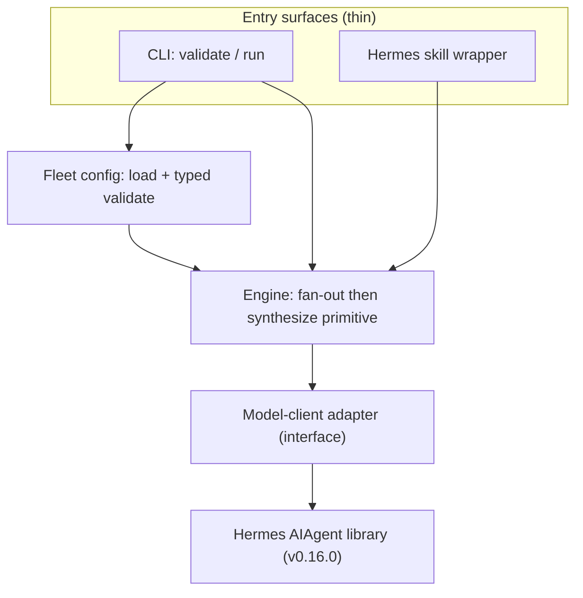
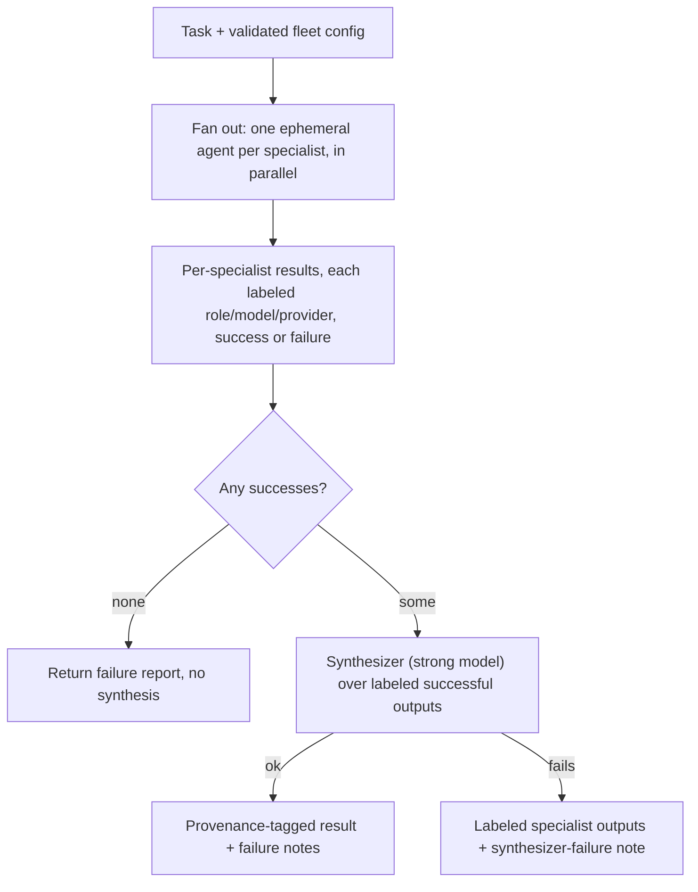

# feat: Agent Fleet Engine MVP — multi-model research swarm in Hermes

## Summary

Build a provider-neutral Python engine that runs ephemeral, multi-model agent fleets (parallel fan-out → synthesize) and invoke it from Hermes as a thin skill. The MVP delivers one fleet — a multi-model research swarm — on an engine whose single orchestration primitive is cleanly separated from fleet config, so later fleets are configuration rather than new code. All model calls go through a thin adapter over Hermes's `AIAgent` library, keeping that pre-1.0 dependency isolated and the orchestration logic testable without live calls.

---

## Problem Frame

Multi-model work has no good home today (see origin: `docs/brainstorms/2026-06-16-agent-fleet-engine-requirements.md`). Hermes's `delegate_task` can't select a model per task; Claude Code fans out only across Anthropic's own tiers. Grok produced a working ~40-line `AIAgent` script, but a one-off script isn't a tool — no reusable patterns, no DX, no path to other fleet shapes. The value is routing the right subtask to the right *provider*, then synthesizing — something no single-vendor runtime offers.

Research strongly resolved the one foundational unknown — with U1 as the empirical gate before U2 builds on it: Hermes's `AIAgent`, called as a library with `provider=` set and `api_key` omitted, inherits OAuth/subscription providers (xAI, Codex, Nous) from `~/.hermes/auth.json` with no API-key env var needed. That makes a provider-neutral engine on top of `AIAgent` viable. The remaining risk is that `AIAgent` is v0.16.0 and volatile, which shapes the architecture below.

---

## Requirements

Carried from origin; grouped by concern. R-IDs are this plan's; intent traces to the brainstorm's requirements of the same number.

**Orchestration engine**
- R1. A fleet runs as parallel fan-out → synthesize: N agents work one task concurrently, then their outputs are combined into one result.
- R2. A fleet is fully defined by configuration — specialist role/focus, model, provider, toolset, plus the synthesis step — with no engine-code changes.
- R3. The engine keeps a clean seam between the orchestration primitive and a fleet's config, so a second primitive or fleet adds without rewriting the first. The primitive system stays minimal — implemented for the one MVP primitive only.
- R4. Fleet agents run ephemerally and statelessly — fresh instance per task, no persistent memory — and tear down on completion.

**Models and providers**
- R5. Each specialist can use a different model; the model set is user-specified, never hardcoded to a provider list.
- R6. Model access uses the user's existing Hermes provider configuration (OAuth, OpenRouter, API keys), with no credential re-wiring.

**Developer experience**
- R7. Adding or changing a fleet requires configuration only — zero Python edits.
- R8. A fleet is invoked with a single Hermes skill call.
- R9. Fleet output is human-readable and directly usable — a synthesized result, not raw concatenated agent outputs.

**Efficacy and output quality**
- R10. Synthesis runs on a strong, orchestrator-tier model.
- R11. Output preserves provenance: each specialist's contribution is labeled by role/model/provider, the synthesizer is instructed to attribute, and citations are preserved so the user can spot-check. (Calibrated for MVP — labeled outputs plus synthesizer attribution, not mechanically-enforced per-claim tracing.)
- R12. The engine leaves a clean seam to compose an independent critique/scoring stage later, without reworking the fan-out → synthesize path.

**Success criteria (from origin)**
- v0 fans out across at least 2 models with at least one non-Anthropic, runs end-to-end in Hermes via one skill call, and returns a synthesized, provenance-tagged result.
- The user can run the same fleet standalone to compare against a single-model baseline.

---

## Key Technical Decisions

- Isolate `AIAgent` behind a thin model-client adapter: it's v0.16.0, pre-1.0, with a 60+ param constructor, an exact-pinned `openai` dependency, and a ~1400-line init — "high internal volatility." The adapter is the one place that knows `AIAgent`, so churn and provider/model-string quirks stay contained, and the engine depends on a small interface that tests fake.

- A fleet spec carries both `provider` and `model` per specialist: research found that, called as a library, `AIAgent` does *not* auto-read the config's default provider. OAuth providers need `provider=` set explicitly with a bare model ID (`provider="xai"`, `model="grok-4.3"`); only OpenRouter takes the full `vendor/model` slug. The config must capture both so the adapter can dispatch correctly.

- Stateless ephemeral execution: `skip_memory=True` and `skip_context_files=True`, a fresh `AIAgent` per thread, run via `ThreadPoolExecutor` — the library's documented parallel pattern. Never share an instance across threads.

- Graceful degradation over all-or-nothing: if a specialist fails (auth error, iteration exhaustion), synthesize from the survivors and report the failure; fail the whole fleet only when every specialist fails. A research swarm is still useful with 2 of 3 lanes.

- Provenance = labeled outputs + synthesizer attribution + preserved citations for MVP: true per-claim mechanical tracing is over-scoped at v1. Each specialist's output is labeled by role/model/provider, the synthesizer receives labeled inputs and is instructed to attribute, and citations pass through. This makes the result spot-checkable, which is the real-world trust bar.

- Config-driven engine, domain in config not Python (adapted from Tonbi's `hermes-multi-agent-workflow`): a typed YAML spec loaded → `from_dict` → hand-rolled `validate()` that accumulates all errors before raising. Zero fleet-domain strings live in the engine. Their persistent-profile/kanban execution model is *not* adopted — only the config/engine/test structure.

- Engine returns structured results, not printed text: the primitive returns a result object holding labeled per-specialist outputs, the synthesized text, and any failure notes. Entry surfaces (CLI, skill) render it. This keeps the engine pure and testable. Exact result shape is left to implementation — it should not be over-designed from one fleet.

- Standalone runner plus a thin Hermes skill: the engine runs without Hermes (a `validate`/`run` CLI), and Hermes is one wrapper that calls it. The standalone path enables the baseline gut-check and faster dogfooding, and keeps the cross-runtime north star to "write another wrapper."

---

## High-Level Technical Design

Component topology — `AIAgent` is touched only by the adapter; the engine depends on the adapter interface, which tests replace with a fake:



Runtime flow — parallel fan-out, then synthesize, with the partial-failure branch:



---

## Output Structure

Greenfield layout the plan creates. The per-unit Files lists are authoritative; this tree is the scope declaration, adjustable during implementation. No literal secrets live in the repo — fleet YAML and the spike carry provider names and model strings only, never keys or tokens; credentials come from the environment and Hermes auth, and `.gitignore` covers `.env*` and local credential files.

```text
fleet_engine/
  __init__.py
  config.py          # typed fleet spec, load() + from_dict() + validate()
  model_client.py    # thin adapter over AIAgent (the isolation seam)
  engine.py          # fan-out -> synthesize primitive, result types
  cli.py             # validate / run entry points
fleets/
  research-swarm.yaml # the first real fleet (v0 deliverable)
skills/
  research-swarm/
    SKILL.md         # thin Hermes wrapper
    run.py           # calls the engine
spikes/
  verify_aiagent_providers.py  # throwaway verification spike (U1)
tests/
  test_config.py
  test_model_client.py
  test_engine.py
  test_cli.py
requirements.txt     # pins hermes-agent (git tag/SHA) + pyyaml
.gitignore           # excludes .env*, auth/secret files, local caches
```

---

## Implementation Units

### U1. Verification spike: confirm AIAgent provider/model resolution against the real Hermes setup

- **Goal:** Empirically confirm the research-resolved mechanism before building on it — that `AIAgent(provider=..., model=..., api_key omitted)` inherits the user's OAuth/configured providers and returns output, for at least 2 providers including 1 non-Anthropic, using the user's actual model strings.
- **Requirements:** R5, R6 (de-risks them).
- **Dependencies:** none. Needs the user to supply real model strings, a working Hermes auth (`~/.hermes/auth.json` populated), and search-tool credentials for any tool-enabled specialist (see Risks & Dependencies).
- **Files:** `spikes/verify_aiagent_providers.py`
- **Approach:** For each `(provider, model)` the user supplies, construct a stateless `AIAgent`, send a trivial prompt, and record success/failure and the provider actually used. Also confirm one tool-enabled specialist (e.g. a `web`-toolset agent) actually invokes its tool — search credentials are a credential axis separate from model-provider OAuth, and a specialist with a working model but an unauthed toolset emits ungrounded prose. Also deliberately trigger one failure (a bad model string or provider) and record the exact exception type and message `AIAgent` raises — U2's catch logic targets that observed type, not an assumed `RuntimeError`. Print a table. Throwaway — its only job is to confirm or refute the integration assumptions and pin the exact constructor arguments per provider type (OpenRouter slug vs explicit provider + bare model).
- **Execution note:** This is a spike, run manually against live Hermes — not production code. If it refutes the assumption, stop and revisit the adapter design in U2 before proceeding.
- **Test scenarios:** Test expectation: none — throwaway spike. Verification is the run itself.
- **Verification:** At least 2 providers return output, including 1 non-Anthropic, with the user's model strings; at least one tool-enabled specialist successfully invokes its search tool; the working constructor-argument shape per provider is recorded for U2, along with the exception type raised on a deliberate failure.

### U2. Model-client adapter over AIAgent

- **Goal:** A thin adapter that is the only code aware of `AIAgent` — it constructs a stateless agent for a given role/provider/model/toolset, runs one prompt, returns a labeled result, and maps `AIAgent` failures to a typed outcome. The engine depends on this interface, not on `AIAgent`.
- **Requirements:** R4, R5, R6.
- **Dependencies:** U1 (confirms real argument shapes).
- **Files:** `fleet_engine/model_client.py`, `tests/test_model_client.py`, `requirements.txt` (pin `pyyaml`; pin `hermes-agent` via its git source with a tag or SHA — it is not on PyPI, so a bare-name pin cannot lock the version)
- **Approach:** Expose a small interface (e.g., run a single specialist → a result carrying text plus the role/model/provider label, or a typed failure). Set `skip_memory=True`, `skip_context_files=True`, `quiet_mode=True`. Apply the per-provider model-string rule from U1 (OpenRouter slug vs explicit provider + bare model). Catch `AIAgent` `RuntimeError`/iteration exhaustion and return a failure outcome rather than raising. Make the `AIAgent` construction injectable — the adapter accepts an agent factory — so tests substitute a fake with no live calls. Keep the interface narrow so the engine can run against a fake.
- **Patterns to follow:** Tonbi's principle of keeping model calls at one boundary so the rest stays deterministic (`engine/` in `hermes-multi-agent-workflow` has zero model calls).
- **Test scenarios:**
  - Given an OpenRouter specialist, the adapter builds the agent with the full `vendor/model` slug and stateless flags set. (fake `AIAgent`)
  - Given an OAuth-provider specialist, the adapter passes `provider=` plus the bare model ID. (fake `AIAgent`)
  - A successful run returns text labeled with role/model/provider.
  - A specialist whose underlying agent raises `RuntimeError` returns a typed failure outcome, not an exception.
- **Verification:** Adapter unit tests pass using a fake `AIAgent`; no live provider calls in the suite.

### U3. Fleet config schema, loader, and validation

- **Goal:** Define and load the fleet spec — specialists (role, focus/prompt, provider, model, toolset) and the synthesis step (synthesizer provider/model, synthesis prompt) — as typed objects with hand-rolled validation.
- **Requirements:** R2, R5, R7.
- **Dependencies:** none (pure config; can land alongside U2).
- **Files:** `fleet_engine/config.py`, `tests/test_config.py`
- **Approach:** `load(path)` → `yaml.safe_load` → `from_dict(data)` building typed dataclasses → `validate()` that accumulates all errors and raises once. Validate: every specialist has provider + model + role; a synthesis step exists with provider + model; required top-level keys present. Gate privileged toolsets (`terminal`, `code_execution`, file-write) behind an explicit opt-in field, so a specialist that ingests untrusted web content can't silently gain local execution from a config typo; the MVP fleet uses only read/search tools (`web`, `x_search`). Keep the schema minimal — only fields the one primitive needs.
- **Patterns to follow:** `engine/config.py` in `hermes-multi-agent-workflow` — `req(key)` helper, accumulate-then-raise `validate()`, and the `make_config(**overrides)` test fixture pattern.
- **Test scenarios:**
  - A valid spec loads into the typed object with specialists and synthesis populated.
  - A spec missing a required top-level key raises a config error naming the key.
  - A specialist missing `provider` or `model` is reported by `validate()`.
  - Multiple invalid fields are all reported in one raise, not just the first.
- **Verification:** Config tests pass; loading the real `fleets/research-swarm.yaml` (U7) validates clean.

### U4. Orchestration primitive: parallel fan-out → synthesize

- **Goal:** The engine core — given a validated fleet config, a task, and the adapter, fan out one ephemeral agent per specialist in parallel, gather labeled outputs, synthesize over the successful ones with a strong model, and return a provenance-tagged result with any failure notes.
- **Requirements:** R1, R3, R4, R9, R10, R11, R12.
- **Dependencies:** U2, U3.
- **Files:** `fleet_engine/engine.py`, `tests/test_engine.py`
- **Approach:** Run specialists via `ThreadPoolExecutor`, one adapter call each. Collect results; partition success/failure. If no successes, return a failure result (no synthesis). Otherwise build a synthesizer prompt from the task plus the labeled successful outputs and run it through the adapter. If the synthesizer call itself fails, return the labeled specialist outputs plus a synthesizer-failure note (no synthesized text) rather than raising — a partial result that still honors R9. Treat an empty specialist response as a failure, not a labeled success, so it never reaches the synthesizer as silent ungrounded provenance. Return a result object holding labeled per-specialist outputs, synthesized text, and failure notes. Keep the primitive generic — it reads config, it does not contain fleet-domain strings. Leave a seam (a post-synthesis hook point) where an independent critic stage can later compose, without building it.
- **Test scenarios:**
  - Happy path: 3 specialists succeed → synthesizer receives 3 labeled inputs → result carries synthesized text and all 3 provenance labels. (fake adapter)
  - Partial failure: 1 of 3 fails → synthesis runs over the 2 survivors; the result records the failure. (fake adapter)
  - Total failure: all specialists fail → failure result, synthesizer not invoked.
  - Synthesizer failure: specialists succeed but the synthesizer call fails → result returns the labeled specialist outputs plus a synthesizer-failure note, no synthesized text. (fake adapter)
  - Empty specialist output is classified as a failure, not a labeled success.
  - Provenance: each specialist's output in the result is labeled with role/model/provider, and the synthesizer input is labeled.
  - Fan-out: the adapter is invoked once per specialist (instance-per-task), concurrently.
- **Verification:** Engine tests pass against a fake adapter covering success, partial, and total-failure paths; no live calls.

### U5. Standalone CLI: validate and run

- **Goal:** A CLI to `validate` a fleet spec and `run` a fleet on a task directly (no Hermes) — enabling the baseline gut-check and dogfooding.
- **Requirements:** R7, R9, and the standalone-run success criterion.
- **Dependencies:** U3 (validate), U4 (run).
- **Files:** `fleet_engine/cli.py`, `tests/test_cli.py`
- **Approach:** `validate <spec>` loads the config and prints a clean pass/fail summary (warn, non-zero exit on failure). `run <spec> --task "..."` wires config + real adapter + engine and renders the provenance-tagged result readably. Keep rendering in the CLI, not the engine.
- **Patterns to follow:** `cli/triage.py` `validate` in `hermes-multi-agent-workflow` (load → summarize → clear green/red signal).
- **Test scenarios:**
  - `validate` on a good spec prints success and exits zero.
  - `validate` on a bad spec prints the errors and exits non-zero.
  - `run` wires config + engine + a fake adapter and renders synthesized text with visible per-specialist provenance. (dependency-injected fake)
- **Verification:** CLI tests pass with a fake adapter; `validate fleets/research-swarm.yaml` passes against the real file.

### U6. Hermes skill wrapper

- **Goal:** A thin Hermes skill so the research swarm is invokable with one skill call (R8). The skill carries no orchestration logic — it calls the engine.
- **Requirements:** R8, R9.
- **Dependencies:** U4, U7 (runs the engine on the research-swarm fleet; U3 transitively). Not U5 — the skill calls the engine directly per the component topology, not through the CLI.
- **Files:** `skills/research-swarm/SKILL.md`, `skills/research-swarm/run.py`
- **Approach:** `SKILL.md` declares the trigger and procedure (gather the task, call the engine entry on the research-swarm fleet, return the synthesized result) and its required environment. `run.py` is a thin call into the engine entry (not the CLI — rendering stays in the CLI layer per U5). Keep the model judgment in the fleet, the determinism in the engine — the skill is glue.
- **Test scenarios:** Test expectation: light — the skill is a thin declarative wrapper. A smoke test asserts `run.py` invokes the engine entry with the task and the research-swarm config. End-to-end behavior is verified manually in Hermes.
- **Verification:** In Hermes, one skill call runs the research swarm and returns a synthesized, provenance-tagged result (the v0 acceptance).

### U7. Research-swarm fleet definition and provenance-aware synthesis

- **Goal:** Author the first real fleet — specialists across providers (e.g., social via Grok/xAI, web via a cheap model, analysis via a strong model), each with provider + model + toolset + focus, plus a synthesizer with a provenance-preserving synthesis prompt. This is the v0 deliverable proving the thesis (≥2 models, ≥1 non-Anthropic).
- **Requirements:** R1, R5, R10, R11, and the v0 success criterion.
- **Dependencies:** U3 (schema), U4 (engine); uses the model strings confirmed in U1.
- **Files:** `fleets/research-swarm.yaml`
- **Approach:** Populate specialists with the user's confirmed provider/model strings, picking non-Anthropic models for the fan-out (cost: Claude in Hermes bills at API rates, so it's not the default workhorse). Write the synthesis prompt to instruct attribution per specialist and citation preservation. Toolsets per specialist per the research findings (e.g. `web` for web research, `x_search` for social); document the credential each lane needs — `x_search` requires SuperGrok OAuth or an xAI key, and `web` search requires a search-provider key (Tavily/Serper/Brave).
- **Test scenarios:** Config validates (covered by U3's loader). Behavioral efficacy is the manual gut-check — run the swarm vs a single strong-model baseline on a few real tasks and confirm it wins. Not a unit test.
- **Verification:** `validate` passes; a standalone `run` and a Hermes skill call both return a synthesized, attributed, citation-preserving result across ≥2 providers including ≥1 non-Anthropic.

---

## Scope Boundaries

### Deferred for later (roadmap, from origin)

- Additional fleet patterns (code/PR review, output validator, advisor panel, debate-and-judge) and additional primitives (critique loop, sequential, debate) — added as reached for.
- The independent critic / confidence-scoring stage — U4 leaves the seam; the stage is built later.
- Other runtimes (Claude Code skill, standalone CLI as a product, MCP server) and non-Hermes provider access including OAuth outside Hermes.
- Local models (Gemma, Qwen) as fleet members — supported by the design, wired in after the cloud/OAuth path is proven.
- The auto-orchestrator north star (describe a task → fleet assembled on the fly).
- OSS packaging, docs, and positioning for users beyond the author.

### Outside this product's identity (from origin)

- Persistent-profile pipelines with crons, a kanban board, and human approval gates — a different product (Tonbi's `hermes-multi-agent-workflow` occupies it). This tool is ephemeral, on-demand fleets.
- A bulletproof automated quality metric — it doesn't exist; efficacy is a harness property plus human spot-check.
- A general multi-agent framework competing with LangGraph/CrewAI/Mastra on adoption.

### Deferred to Follow-Up Work (plan-local)

- A `scaffold` CLI command (Tonbi has one) — unnecessary for the MVP, which has no profiles/crons to scaffold.
- Per-fleet cost/token tracking and logging.
- A wall-clock timeout per specialist (beyond `AIAgent`'s `max_iterations`) — add if a hung provider proves to stall fan-out in practice.

---

## Risks & Dependencies

- `AIAgent` is pre-1.0 and volatile (v0.16.0, exact-pinned `openai`, ~1400-line init). Mitigation: the U2 adapter isolates it; pin `hermes-agent` by git tag/SHA in `requirements.txt` (it is git-distributed, not on PyPI); U1 confirms current behavior before the build.
- OAuth/model-string behavior in the user's actual setup may differ from the research. Mitigation: U1 spike gates U2+; the user supplies real strings.
- Runtime provider failures or latency. Mitigation: graceful degradation (U4); per-specialist timeout deferred unless needed.
- Efficacy is not automatable. Mitigation by design: strong synthesizer + provenance for spot-check + baseline gut-check; critic-stage seam for later. The plan does not claim an automated quality guarantee.
- Cost: Claude inside Hermes bills at API "extra usage" rates. Mitigation: default the fan-out to non-Anthropic models; the user controls model choice via config.
- Dependency: a working Hermes install with OAuth providers authenticated (`~/.hermes/auth.json`). The engine assumes configured providers; it does not manage credentials.
- Search-tool credentials are a separate axis from model-provider OAuth: `web` search needs a search-provider key (Tavily/Serper/Brave) and `x_search` needs SuperGrok OAuth or an xAI key. A specialist with a working model but an unauthed toolset returns ungrounded prose, undercutting provenance (R11) and the beats-baseline criterion. U1 verifies tool invocation; U7 documents the credential each lane needs.

---

## Open Questions

### Deferred to implementation

- Exact result-object shape and the synthesizer-input format — settled while building U4 against the one fleet; deliberately not pre-designed.
- The exact model strings and toolsets for each research-swarm specialist — supplied by the user and confirmed in U1.
- Whether `x_search` (social lane) needs an xAI key in addition to OAuth, per its toolset note — confirmed during U1/U7.

---

## Sources / Research

- Origin brainstorm: `docs/brainstorms/2026-06-16-agent-fleet-engine-requirements.md` — problem frame, requirements, scope boundaries, key decisions.
- Hermes `AIAgent` library (NousResearch/hermes-agent, v0.16.0): per-instance `model`; `provider=` + omitted `api_key` inherits OAuth/configured providers from `~/.hermes/auth.json`; OpenRouter uses full `vendor/model` slug while OAuth providers use `provider=` + bare model ID; stateless parallel pattern is `skip_memory`/`skip_context_files` + `ThreadPoolExecutor`, instance-per-thread; toolset names include `web`, `x_search`, `browser`, `file`. Docs: `https://hermes-agent.nousresearch.com/docs/guides/python-library`.
- Tonbi Studio's `hermes-multi-agent-workflow` (separate local reference fork): "fat engine, thin skill" with zero domain strings in `engine/`; typed YAML config via `load` → `from_dict` → accumulate-then-raise `validate()`; `validate`/`scaffold` CLI; stdlib `unittest` with a `make_config(**overrides)` fixture and no model mocking (model calls kept out of the engine). Execution model (persistent profiles + kanban) not adopted.
